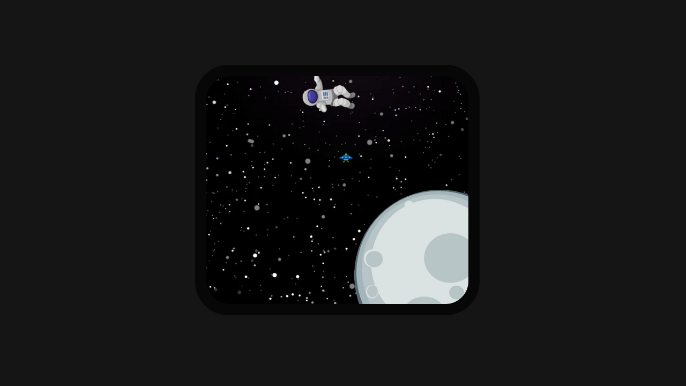

# ImageAnimation

## Simple image animation

### tecnologias usadas 

Meu portifolio foi criado com Html / CSS(Sass) / Javascript. 

<table>
  <tbody>
    <tr valign="top">
      <td width="10%" align="center">
        𝗛𝗧𝗠𝗟𝟱   
        
      </td>
      <td width="10%" align="center">
        𝗖𝗦𝗦𝟯   
        
      </td>
      <td width="10%" align="center">
        𝗝𝗮𝘃𝗮𝗦𝗰𝗿𝗶𝗽𝘁   
        
      </td>                                                                
  </tbody>
</table>
